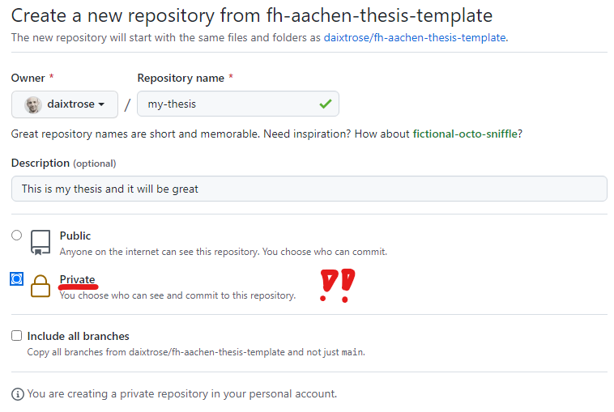
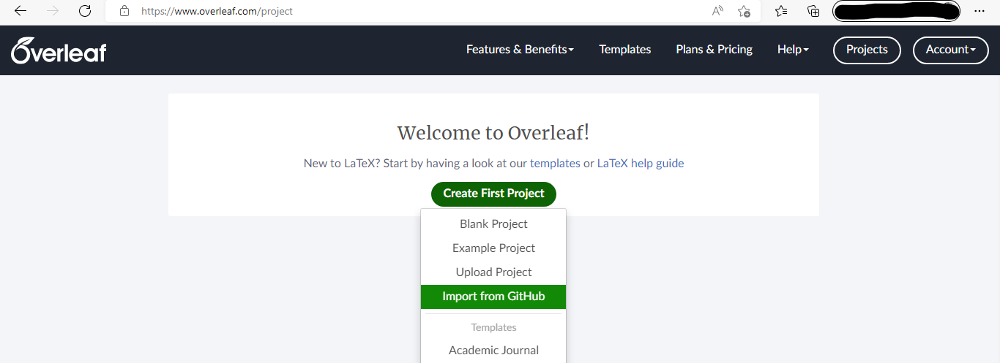
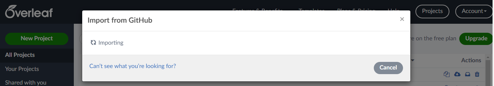
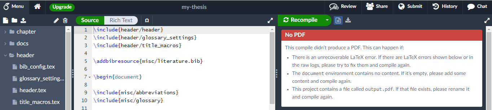
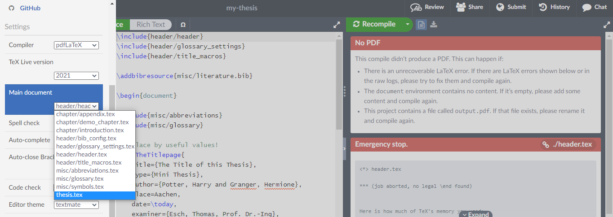
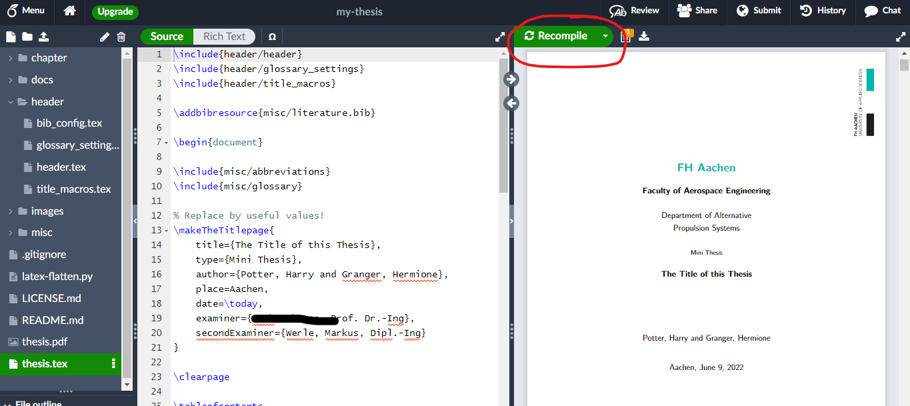
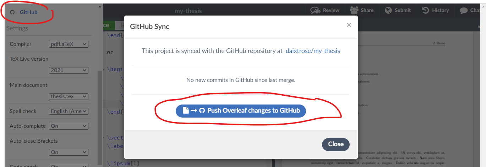

# Inofficial Thesis Template for FH Aachen

## Introduction

This is a LaTeX template that can be used (and adopted) for a Thesis at FH Aachen. If you want to start with this project, create your own copy by [using this repository as a template](https://docs.github.com/en/repositories/creating-and-managing-repositories/creating-a-repository-from-a-template), i.e. just press the `use this template`button above. 


If you are new to LaTeX please check the examples in [chapter/demo_chapter.tex](chapter/demo_chapter.tex). We also recommend the Material provided by [Overleaf](https://www.overleaf.com/).

## Establishing a Developer Environment 

### Beginner's Approach with a Paid Overleaf User Account 

- Create your own GitHub repository based on this one by [using this repository as a template](https://docs.github.com/en/repositories/creating-and-managing-repositories/creating-a-repository-from-a-template):
  
- Visit [Overleaf](https://www.overleaf.com/) and create a paid user account
- Choose to create a new project and choose to import it from GitHub
  
- Then select form the alphabetically ordered list the newly created repository and select it
  
  
- You should now see the project but with a failed compilation
  
- Click on the menu in the upper left corner and configure the main document to be `thesis.tex`  

- Press the green button labelled `Recompile` and wait approximately 35 seconds 

- If you want to sync back to your repository, click on the menu in the upper left corner, then on the entry `GitHub`. A dialog will appear which allows to push (aka sync) the changes from Oeverlef back into the repository.  


### Bare Metal Approach

> This approach is only for users that know Linux and want to have full control

- Create your own GitHub repository based on this one by [using this repository as a template](https://docs.github.com/en/repositories/creating-and-managing-repositories/creating-a-repository-from-a-template)
- Install any decent Linux distro like e.g [Ubuntu](https://ubuntu.com/)
- Install git and a LaTeX distribution. For Ubuntu we recommend 
  ```bash
  sudo apt install git texlive-full texlive-extra-utils latexmk 
  ``` 
- Download and install the latest Debian or RPM package of [Visual Studio Code](https://code.visualstudio.com/)
  - Start VsCode and install the [GitLens Plugin](https://marketplace.visualstudio.com/items?itemName=eamodio.gitlens) and [LaTeX Workshop Plugin](https://marketplace.visualstudio.com/items?itemName=James-Yu.latex-workshop). 
- Start VsCode, open its shell and clone your repostory. Follow the authentication requests. 
  ```bash
  git clone https://github.com/yourname/your-repository-name
  cd your-repository-name
  ```
- For building the PDF file you can either rely on the [LaTeX Workshop Plugin](https://marketplace.visualstudio.com/items?itemName=James-Yu.latex-workshop) or disable its automatic start by pressing `Ctrl+,` or selecting from the menu `File -> Prefereces -> Settings`. Then search for `latex workshop auto build: run`and set it to never. Then you can compile the PDF via the command line
  ```bash
  latexmk -pdf thesis
  ```
  Compilation errors might lead to an hickup. If you feel like you should start all over again, use  
  ```bash
  latexmk -c thesis
  latexmk -pdf thesis
  ```
- after you are done with your changes, commit and push them back. Either [through the GUI features of VsCode](https://code.visualstudio.com/docs/editor/versioncontrol) or via command line
  ```bash
  git add -A
  git commit -m "some comments"
  git push
  ```

